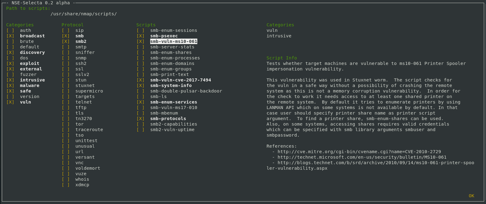
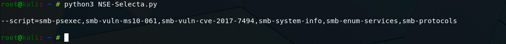

# NSE-Selecta
Python script to select nmap nse scripts.

## Dependencies
- Python3
- npyscreen (https://github.com/npcole/npyscreen)

```
pip3 install npyscreen
```

## Usage
Make sure your terminal window is big enough and run NSE-Selecta.py with python3.
```
python3 NSE-Selecta.py
```
Confirm the default path to the NSE-Scripts with enter or change it and confirm.

#### Create the script string
Make your choices, select OK in the bottom right corner and hit enter. You get a string with the selected nse scripts.

#### Categories
Exclude scripts with deselected categories.

#### Protocols
The first part of the nse script filename. Select the Protocols to show the scripts that begins with the selected Protocol.

#### Scripts
The Filtered scripts. Select the scripts you would like to use.


## Screenshots


